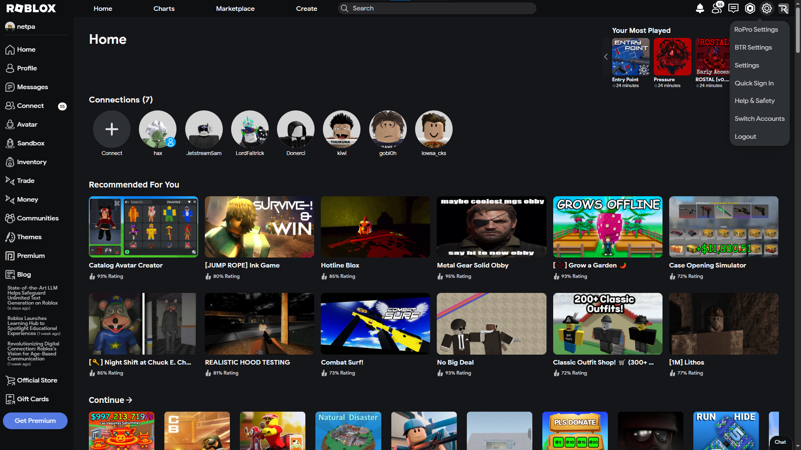
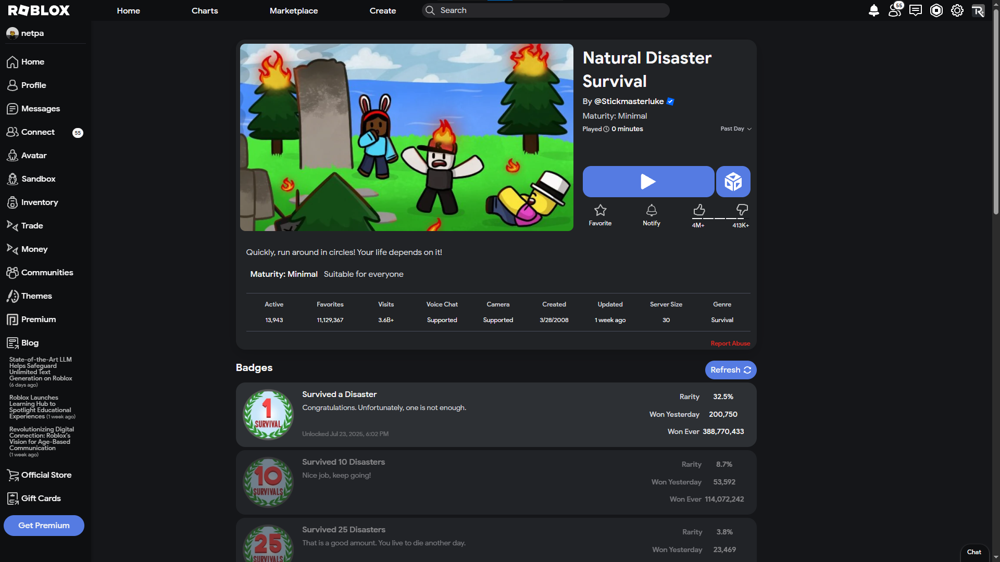
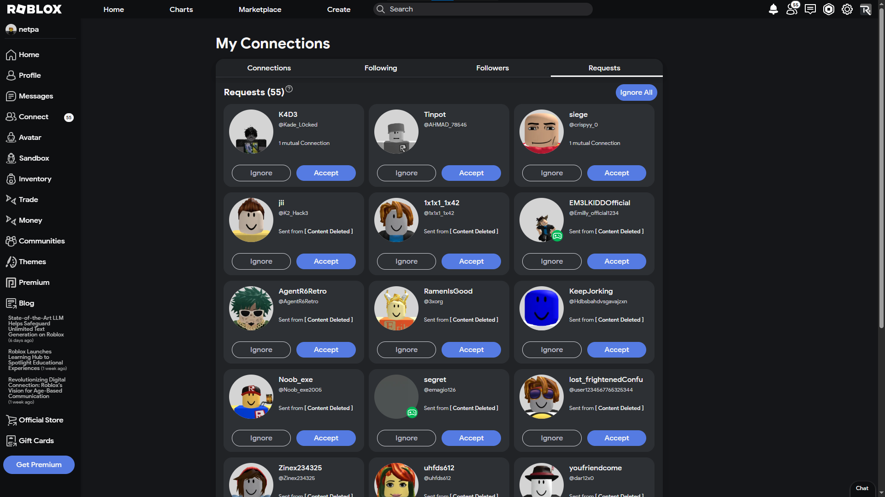
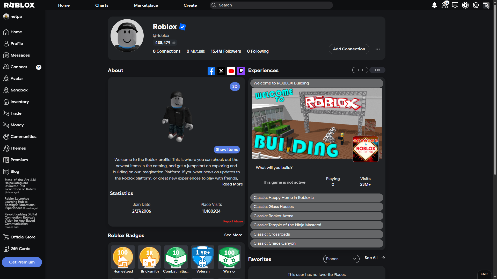
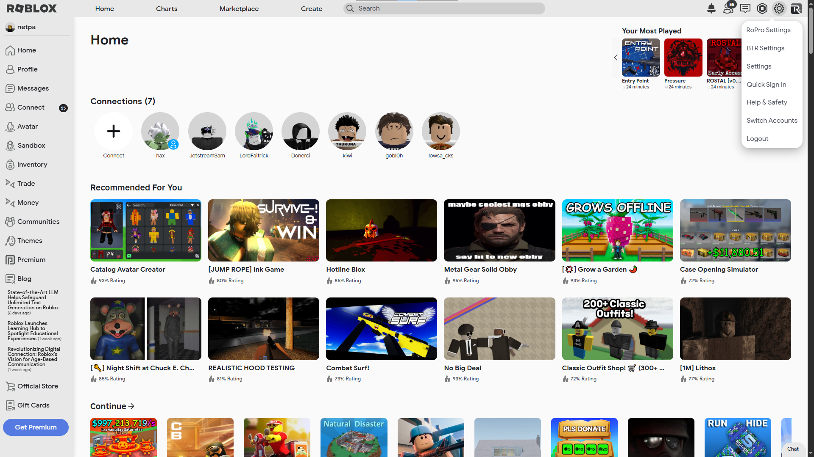
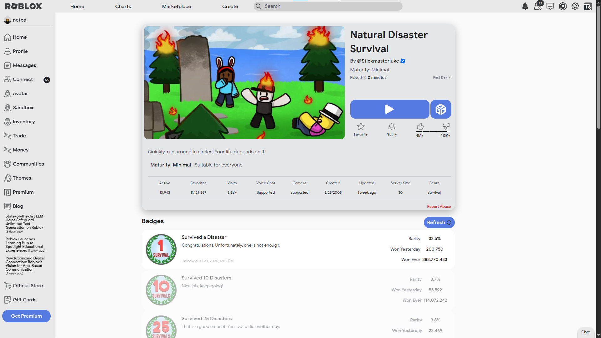
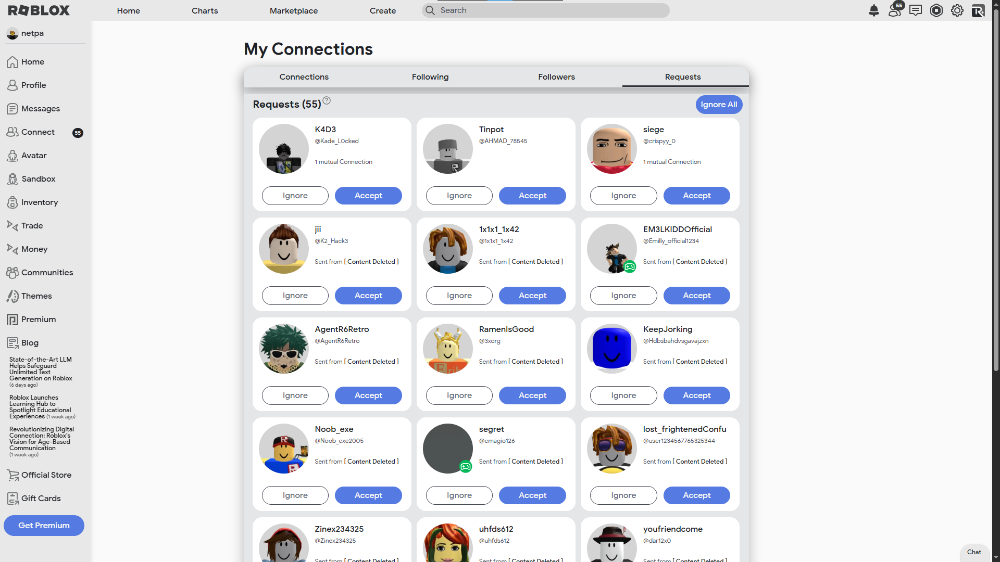
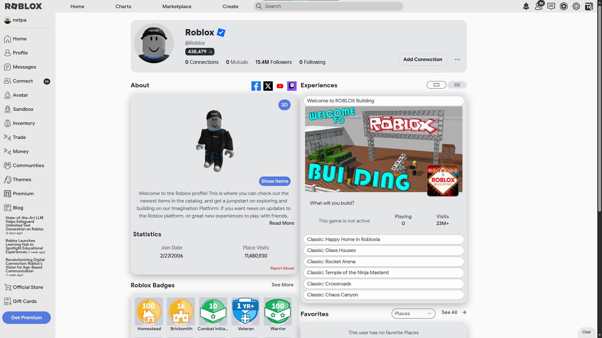

<h1 align = "center"> Material-for-Roblox </h1>

 A theme for <a href = "https://www.roblox.com/">Roblox</a> based on <a href = "https://m3.material.io/">Google's Material design</a>. 

<h2 align = "center"> Previews </h2>

  <h3>

    
Dark Theme

    <h5>
      • Home Page
      
      • Game Page
      
      • Friends (Connections) Page
      
      • Profile Page
      
    </h5>
  

  

    
Light Theme

    <h5>
      • Home Page
      
      • Game Page
      
      • Friends (Connections) Page
      
      • Profile Page
      
    </h5>
  
</h3>

